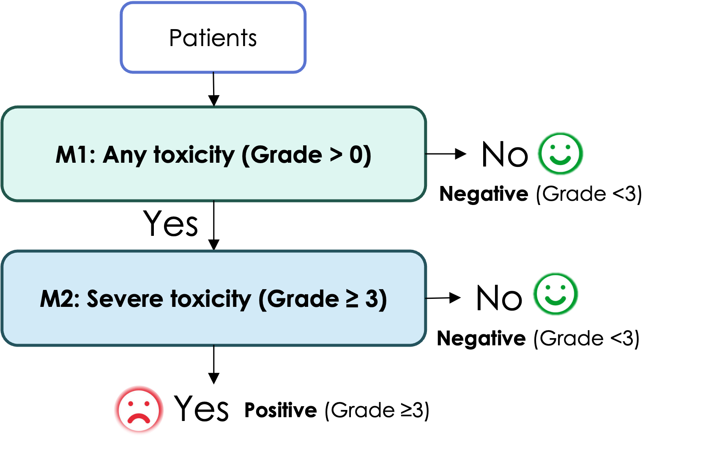

# XGB-ToxPredict

<p align="center">

  

</p>

XGB-ToxPredict is an XGBoost-based machine learning pipeline for predicting treatment-related toxicity in patients with hepatocellular carcinoma (HCC). The framework adopts a hierarchical two-stage classification strategy that first identifies patients at risk of developing any toxicity and then stratifies those patients according to toxicity severity.
The pipeline consists of two sequential models:
* Model 1 (M1): Any Toxicity Prediction – Predicts whether a patient will experience treatment-related toxicity (Grade > 0) using the complete patient cohort.
* Model 2 (M2): Severe Toxicity Prediction – Applied only to patients predicted to have toxicity by M1. This model is trained on patients with Grades 1–5 and predicts severe toxicity (Grade ≥3), distinguishing mild/moderate toxicity from severe cases.

This cascaded design decomposes toxicity prediction into two clinically meaningful binary classification tasks, improving interpretability while allowing independent optimization of each prediction stage.


# XGB-ToxPredict

Two-stage XGBoost pipeline for screening treatment-related toxicity:

```
Patients
   |
   v
M1: Any toxicity (Grade > 0)?  --No-->  Negative (Grade < 3)
   |Yes
   v
M2: Severe toxicity (Grade >= 3)?  --No-->  Negative (Grade < 3)
   |Yes
   v
Positive (Grade >= 3)


python pre_process.py --config_path path/to/config.yaml


## Repository layout

```
common/
  config.py     - YAML config loading (one copy, was three)
  data.py       - dataset loading, feature/target split
  metrics.py    - ECE, threshold metrics, cascade metrics
  plotting.py   - ROC/PR/calibration/confusion-matrix/SHAP plots
  xgb_stage.py  - single-stage XGBoost: CV + final model fit + SHAP
stages/
  train.py      - trains one stage: `python -m stages.train --config configs/m1.yaml`
  test.py       - evaluates one stage on its held-out test set
hierarchical/
  predict.py    - runs the M1 -> M2 cascade end-to-end (the flowchart above)
configs/
  m1.yaml, m2.yaml, hierarchical.yaml
M1/, M2/        - per-stage datasets + trained models (xgb_final_model.joblib)
dataset/        - dataset for the hierarchical cascade evaluation
```

## Usage

```bash
pip install -r requirements.txt

# Train each stage independently
python -m stages.train --config configs/m1.yaml
python -m stages.train --config configs/m2.yaml

# Evaluate each stage on its own held-out test set
python -m stages.test --config configs/m1.yaml
python -m stages.test --config configs/m2.yaml

# Run the full M1 -> M2 cascade
python -m hierarchical.predict --config configs/hierarchical.yaml
```


